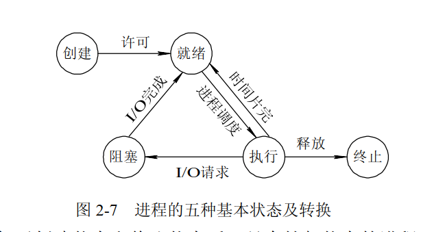

# 第四讲

完成完整的内核中断处理逻辑和时钟中断逻辑.

这里,这里特意强调是内核的中断,含义为从内核态到内核态的中断,不包括来自用户态的中断(系统调用`ecall`),主要是外设中断(timer也是一种外设,但是计时器中断在riscv的`sie`<也就是Supervisitor interrupt Exception>寄存器中专门设置了一位用来表示开启计时器中断,而其他的外设共同设置为一位表示开启外设中断)

## 逻辑梳理

先来看到初始化的步骤:

```C
kinit();         // physical page allocator
kvminit();       // create kernel page table
kvminithart();   // turn on paging

procinit();      // process table

trapinit();      // trap vectors
trapinithart();  // install kernel trap vector
plicinit();      // set up interrupt controller
plicinithart();  // ask PLIC for device interrupts

binit();         // buffer cache
iinit();         // inode table
```


注意这里是先初始化进程表,后初始化中断相关的操作.但是进程管理是第五讲的内容,可是这里又涉及到进程管理的内容.所以先了解中断的逻辑,在完成中断逻辑后再处理进程相关的逻辑.

关键看到接下来的四个函数的初始化函数:

```c

trapinit();      // trap vectors
trapinithart();  // install kernel trap vector
plicinit();      // set up interrupt controller
plicinithart();  // ask PLIC for device interrupts

```

这里,先简单讲述一下他们四个的逻辑:

### 内核中断设置与处理

- `trapinit()`,按照xv6的逻辑,这种总的初始化一般是软件设置,所以这个函数的唯一功能就是初始化一个自旋锁,用处不大.

- `trapinithart()`,也很简单,就是将stvec(Supervisior Trap Vector)的数值设定为`kernevlvec.S`中的`kernelvec`的地址,而这个文件的内容也很简单,如下:

  ```asm
  .globl kerneltrap
  .globl kernelvec
  .align 4
  kernelvec:
          # make room to save registers.
          addi sp, sp, -256
  
          # save caller-saved registers.
          sd ra, 0(sp)
          # sd sp, 8(sp)
          sd gp, 16(sp)
          sd tp, 24(sp)
          sd t0, 32(sp)
          sd t1, 40(sp)
          sd t2, 48(sp)
          sd a0, 72(sp)
          sd a1, 80(sp)
          sd a2, 88(sp)
          sd a3, 96(sp)
          sd a4, 104(sp)
          sd a5, 112(sp)
          sd a6, 120(sp)
          sd a7, 128(sp)
          sd t3, 216(sp)
          sd t4, 224(sp)
          sd t5, 232(sp)
          sd t6, 240(sp)
  
          # call the C trap handler in trap.c
          call kerneltrap
  
          # restore registers.
          ld ra, 0(sp)
          # ld sp, 8(sp)
          ld gp, 16(sp)
          # not tp (contains hartid), in case we moved CPUs
          ld t0, 32(sp)
          ld t1, 40(sp)
          ld t2, 48(sp)
          ld a0, 72(sp)
          ld a1, 80(sp)
          ld a2, 88(sp)
          ld a3, 96(sp)
          ld a4, 104(sp)
          ld a5, 112(sp)
          ld a6, 120(sp)
          ld a7, 128(sp)
          ld t3, 216(sp)
          ld t4, 224(sp)
          ld t5, 232(sp)
          ld t6, 240(sp)
  
          addi sp, sp, 256
  
          # return to whatever we were doing in the kernel.
          sret
  ```

  其他的很简单,各种乱七八糟的是上下文保存,最后的`sret`和前面见过的`mret`内容很类似.

  这里的`kerneltrap`就是一个处理各种类型的中断的函数,由于在我们中断的时候,特定的寄存器会设置中断的位置,原因等等信息,这个函数就会直接从这些寄存器中读出数值来判断中断的原因,从而使用不同的方式处理,函数的内容如下:

  ```c
  
  // interrupts and exceptions from kernel code go here via kernelvec,
  // on whatever the current kernel stack is.
  void 
  kerneltrap()
  {
    int which_dev = 0;
    uint64 sepc = r_sepc();
    uint64 sstatus = r_sstatus();
    uint64 scause = r_scause();
    
    if((sstatus & SSTATUS_SPP) == 0)
      panic("kerneltrap: not from supervisor mode");
    if(intr_get() != 0)
      panic("kerneltrap: interrupts enabled");
  
    if((which_dev = devintr()) == 0){
      // interrupt or trap from an unknown source
      printf("scause=0x%lx sepc=0x%lx stval=0x%lx\n", scause, r_sepc(), r_stval());
      panic("kerneltrap");
    }
  
    // give up the CPU if this is a timer interrupt.
    if(which_dev == 2 && myproc() != 0)
      yield();
  
    // the yield() may have caused some traps to occur,
    // so restore trap registers for use by kernelvec.S's sepc instruction.
    w_sepc(sepc);
    w_sstatus(sstatus);
  }
  
  ```

  看到这里的三个寄存器,分别是`sepc`(Exception Programmer Counter),`sstuatus`和`scause`的关键寄存器的数值.

  然后是两段安全检查:

  ```c
    if((sstatus & SSTATUS_SPP) == 0)
      panic("kerneltrap: not from supervisor mode");
    if(intr_get() != 0)
      panic("kerneltrap: interrupts enabled");
  
  ```

  这里是三个断言,第一个的SPP代表Supervisor Previous Privilege,表示在发生中断前的系统状态是不是内核模式,如果这个是0,说明中断违反了设计的初衷,所以会中断.

  第二个判断很有意思,他表明了xv6不支持嵌套中断,原因是在发生中断后,硬件会自动关闭中断使能,保证中断不会嵌套发生.

  ```c
  
    if((which_dev = devintr()) == 0){
      // interrupt or trap from an unknown source
      printf("scause=0x%lx sepc=0x%lx stval=0x%lx\n", scause, r_sepc(), r_stval());
      panic("kerneltrap");
    }
  ```

  接下来,是判断中断的来源,这里是通过devintr()函数来实施的,他会读取`scause`的内容来判断中断来自哪一个外设,内容如下:

  ```c
  int
  devintr()
  {
    uint64 scause = r_scause();
  
    if(scause == 0x8000000000000009L){
      // this is a supervisor external interrupt, via PLIC.
  
      // irq indicates which device interrupted.
      int irq = plic_claim();
  
      if(irq == UART0_IRQ){
        uartintr();
      } else if(irq == VIRTIO0_IRQ){
        virtio_disk_intr();
      } else if(irq){
        printf("unexpected interrupt irq=%d\n", irq);
      }
  
      // the PLIC allows each device to raise at most one
      // interrupt at a time; tell the PLIC the device is
      // now allowed to interrupt again.
      if(irq)
        plic_complete(irq);
  
      return 1;
    } else if(scause == 0x8000000000000005L){
      // timer interrupt.
      clockintr();
      return 2;
    } else {
      return 0;
    }
  }
  ```

  首先,开始的判断是一个riscv的规范:

  > **`0x8...`**: 最高位为1，表示这是一个中断。
  >
  > **`...9`**: 末尾的9是RISC-V规范中为**“监督者外部中断 (Supervisor External Interrupt)”**定义的编码。
  >
  > **含义**: 这种中断来自于CPU核心**外部**的设备，并且是通过 **PLIC** (平台级中断控制器) 路由过来的。常见的如串口、磁盘、网卡中断都属于这一类。
  >
  > **`...5`**: 末尾的5是RISC-V规范中为**“监督者时钟中断 (Supervisor Timer Interrupt)”**定义的编码。
  >
  > **含义**: 这种中断来自于CPU核心旁边的CLINT（核心本地中断器），是周期性发生的，用于驱动操作系统进行进程调度。

  

  这里的PLIC是 **Platform-Level Interrupt Controller**, 平台级中断控制器,是现代OS中管理所有外部硬件中断的管理器.

  在确认了是监督者外部中断后,需要向PLIC确定中断的类型.

  ```c
  
  // ask the PLIC what interrupt we should serve.
  int
  plic_claim(void)
  {
    int hart = cpuid();
    int irq = *(uint32*)PLIC_SCLAIM(hart);
    return irq;
  }
  ```

  这里先看一下设备中断,这里需要根据当前的CPU核型来判断中断的类型,因为每一个CPU在PLIC上都有独有的寄存器表示中断的外设,同时注意,这里的寄存器由于不是CPU的寄存器,所以依然是通过内存映射访问的.

  然后根据不同的设备号来处理不同的设备中断,

  处理完成后,如果中断的类型存在,那么需要告诉PLIC我们已经处理了中断,PLIC收到了这个完成的信号后,就会清除这个中断的"正在处理中"的状态.

  > 引自Gemini
  >
  > ### 为什么必须调用 `plic_complete`？
  >
  > 如果您忘记调用 `plic_complete`，将会发生一个致命的后果：**该设备将永远无法再次产生中断**。
  >
  > - **比喻**: 想象一个只有一个呼叫队列的紧急调度中心（PLIC）。
  >   1. UART设备（求助者）打来电话，`plic_claim()`（接线员）接听了电话，队列中的这个呼叫被标记为“通话中”。
  >   2. 内核处理了这个呼叫（执行了 `uartintr()`）。
  >   3. 如果内核**忘记**了调用 `plic_complete()`（接线员忘记挂断电话），那么在PLIC看来，这个呼叫**永远处于“通话中”状态**。
  >   4. 之后，即使UART设备又遇到了新的紧急情况想再次呼叫，PLIC会发现它的线路一直被占用，因此**永远不会再把UART的呼叫接进来**。
  >
  > **最终结果**：您的系统将对那个设备后续的所有中断都“失聪”。例如，如果忘记对UART中断进行`complete`，您的控制台将只能再接收一次键盘输入，之后就再也无法响应了。

  接下来再看时钟中断:

  ```c
  
  void
  clockintr()
  {
    if(cpuid() == 0){
      acquire(&tickslock);
      ticks++;
      wakeup(&ticks);
      release(&tickslock);
    }
  
    // ask for the next timer interrupt. this also clears
    // the interrupt request. 1000000 is about a tenth
    // of a second.
    w_stimecmp(r_time() + 1000000);
  }
  ```

  xv6约定,只有0号CPU才能管理全体的时间管理,这里的wakeup是用来处理`sleep`之类的函数的管理.

  然后,会设置下一次中断的时间,这个就和STM32的中断后需要再次开启中断是一样的.

  接着,返回处理函数中.

  ```c
    
  
    if((which_dev = devintr()) == 0){
      // interrupt or trap from an unknown source
      printf("scause=0x%lx sepc=0x%lx stval=0x%lx\n", scause, r_sepc(), r_stval());
      panic("kerneltrap");
    }
  
    // give up the CPU if this is a timer interrupt.
    if(which_dev == 2 && myproc() != 0)
      yield();
  
    // the yield() may have caused some traps to occur,
    // so restore trap registers for use by kernelvec.S's sepc instruction.
    w_sepc(sepc);
    w_sstatus(sstatus);
  ```

  这里的`yield()`是用来处理进程调度的,表示CPU放弃当前的进程,切换到下一个进程来运行.

  最后,由于在执行切换的过程中,寄存器的状态肯定发生变化,所以这里通过在开头存储寄存器的原始数据实现恢复返回地址和系统状态的功能.

### PLIC设置

```c
plicinit();      // set up interrupt controller
plicinithart();  // ask PLIC for device interrupts
```

接着,是两个PLIC的初始化,在前面的过程中,肯定会有一些疑问,比如,PLIC如何管理设备的优先级别等等.在这里就是为了解决这个设置问题.

```c
void
plicinit(void)
{
  // set desired IRQ priorities non-zero (otherwise disabled).
  *(uint32*)(PLIC + UART0_IRQ*4) = 1;
  *(uint32*)(PLIC + VIRTIO0_IRQ*4) = 1;
}
```

PLIC 内部有一组连续的32位（4字节）寄存器，每个寄存器都用来存放一个中断源的优先级。比如第十号寄存器就是用来管理uart0中断的优先级的,我们这里选择1写入这个寄存器,代表把uart0的中断优先级别设置成1.

接着,是PLIC在CPU中的设置.

```c
void
plicinithart(void)
{
  int hart = cpuid();
  
  // set enable bits for this hart's S-mode
  // for the uart and virtio disk.
  *(uint32*)PLIC_SENABLE(hart) = (1 << UART0_IRQ) | (1 << VIRTIO0_IRQ);

  // set this hart's S-mode priority threshold to 0.
  *(uint32*)PLIC_SPRIORITY(hart) = 0;
}
```

这个函数你会发现不只有CPU0进行了调用,而是所有的CPU都需要处理(在main.c中),因为PLIC需要给所有的CPU发送中断信号,所以必然会在寄存器上做出一些些设置.

```c
*(uint32*)PLIC_SENABLE(hart) = (1 << UART0_IRQ) | (1 << VIRTIO0_IRQ);
```

> **`PLIC_SENABLE(hart)`**: 这个宏会计算出PLIC硬件中，专门用于**当前核心**的**“S模式中断使能（Supervisor Enable）”寄存器**的地址。每个核心都有一个自己独立的使能寄存器。

接着是设置中断屏蔽的寄存器,这里把中断屏蔽寄存器设置成0,代表着所有的大于0 的中断都可以打断内核.

```c
  // set this hart's S-mode priority threshold to 0.
  *(uint32*)PLIC_SPRIORITY(hart) = 0;
```

## 进程初始化与进程调度

### 进程初始化

在这里,接着我们需要实现一些基本的中断处理,比如这里的计时器中断引起的进程调度,所以我们就需要先了解进程运作的基本原理.

```c

// initialize the proc table.
void
procinit(void)
{
  struct proc *p;
  
  initlock(&pid_lock, "nextpid");
  initlock(&wait_lock, "wait_lock");
  for(p = proc; p < &proc[NPROC]; p++) {
      initlock(&p->lock, "proc");
      p->state = UNUSED;
      p->kstack = KSTACK((int) (p - proc));
  }
}
```

这里是初始化进程列表, 可以看到这里的作用就是为每一个进程类分配对应的虚拟页表的栈地址,然后设置进程的状态为没有使用.

首先是进程的状态,进程的状态在xv6中定义在`proc.h`中,包含下面这一些:

```c
enum procstate { UNUSED, USED, SLEEPING, RUNNABLE, RUNNING, ZOMBIE };
```

回忆一下OS的内容,进程一共分为五个状态(暂时不考虑挂起,是否为一个状态在不同的教材中有不同的定义)



这里就是:

- `UNUSED` 表示进程初始化之前,PCB还在空闲PCB列表中的状态.
- `USED` 表示进程初始化阶段,是一个比较短暂的状态
- `RUNNABLE` 表示就绪状态
- `RUNNING` 表示运行状态
- `SLEEPING` 表示进程挂起
- `ZOMBIE` 进程执行完成,但是父进程没有调用`wait()`

然后是进程的栈分配,前面已经实现了在内核虚拟空间中实现了从VA到PA的进程栈映射,但是进程来说并不知道自己的栈在哪里,这里在PCB中有一个指针指向这个栈的位置.

### 进程调度

这里是我认为目前为止设计的最巧妙的地方,到这里终于理解了CPU是如何实现进程调度的.

首先来看到进程调度器

```c
// Per-CPU process scheduler.
// Each CPU calls scheduler() after setting itself up.
// Scheduler never returns.  It loops, doing:
//  - choose a process to run.
//  - swtch to start running that process.
//  - eventually that process transfers control
//    via swtch back to the scheduler.
void
scheduler(void)
{
  struct proc *p;
  struct cpu *c = mycpu();

  c->proc = 0;
  for(;;){
    // The most recent process to run may have had interrupts
    // turned off; enable them to avoid a deadlock if all
    // processes are waiting. Then turn them back off
    // to avoid a possible race between an interrupt
    // and wfi.
    intr_on();
    intr_off();

    int found = 0;
    for(p = proc; p < &proc[NPROC]; p++) {
      acquire(&p->lock);
      if(p->state == RUNNABLE) {
        // Switch to chosen process.  It is the process's job
        // to release its lock and then reacquire it
        // before jumping back to us.
        p->state = RUNNING;
        c->proc = p;
        swtch(&c->context, &p->context);

        // Process is done running for now.
        // It should have changed its p->state before coming back.
        c->proc = 0;
        found = 1;
      }
      release(&p->lock);
    }
    if(found == 0) {
      // nothing to run; stop running on this core until an interrupt.
      asm volatile("wfi");

    }
  }
}
```

首先的第一个很巧妙的地方是

```c
    intr_on();
    intr_off();
```

关中断不是屏蔽中断,而是延迟中断,这里就是短暂开启一个窗口让OS处理中断.

```c
	int found = 0;
    for(p = proc; p < &proc[NPROC]; p++) {
      acquire(&p->lock);
      if(p->state == RUNNABLE) {
        // Switch to chosen process.  It is the process's job
        // to release its lock and then reacquire it
        // before jumping back to us.
        p->state = RUNNING;
        c->proc = p;
        swtch(&c->context, &p->context);

        // Process is done running for now.
        // It should have changed its p->state before coming back.
        c->proc = 0;
        found = 1;
      }
      release(&p->lock);
    }
    if(found == 0) {
      // nothing to run; stop running on this core until an interrupt.
      asm volatile("wfi");

    }
```

接着这里在所有的进程中查找一个准备就绪的,准备运行,看这里的实现:

```c
c->proc = p;
swtch(&c->context, &p->context);
```

CPU里面实际有这样有两个context.

```c

// Per-CPU state.
struct cpu {
  struct proc *proc;          // The process running on this cpu, or null.
  struct context context;     // swtch() here to enter scheduler().
  int noff;                   // Depth of push_off() nesting.
  int intena;                 // Were interrupts enabled before push_off()?
};
```

一个是proc中.保存了进程的一套寄存器.另一个是context里面直接保存了一套寄存器.`stich`实际上就是把CPU的寄存器保存在前面的那个`old`的context中,而把后面那个context的内容载入到寄存器组中.

```asm
# Context switch
#
#   void swtch(struct context *old, struct context *new);
# 
# Save current registers in old. Load from new.	


.globl swtch
swtch:
        sd ra, 0(a0)
        sd sp, 8(a0)
        sd s0, 16(a0)
        sd s1, 24(a0)
        sd s2, 32(a0)
        sd s3, 40(a0)
        sd s4, 48(a0)
        sd s5, 56(a0)
        sd s6, 64(a0)
        sd s7, 72(a0)
        sd s8, 80(a0)
        sd s9, 88(a0)
        sd s10, 96(a0)
        sd s11, 104(a0)

        ld ra, 0(a1)
        ld sp, 8(a1)
        ld s0, 16(a1)
        ld s1, 24(a1)
        ld s2, 32(a1)
        ld s3, 40(a1)
        ld s4, 48(a1)
        ld s5, 56(a1)
        ld s6, 64(a1)
        ld s7, 72(a1)
        ld s8, 80(a1)
        ld s9, 88(a1)
        ld s10, 96(a1)
        ld s11, 104(a1)
        
        ret

	
```

而ret的返回地址是根据`ra`来判断的,这里他就不会直接返回`scheduler()` 中,而是去处理进程对应的程序.

接着,是如何通过计时器中断来实现时间片轮转的呢?

```c
// Switch to scheduler.  Must hold only p->lock
// and have changed proc->state. Saves and restores
// intena because intena is a property of this
// kernel thread, not this CPU. It should
// be proc->intena and proc->noff, but that would
// break in the few places where a lock is held but
// there's no process.
void
sched(void)
{
  int intena;
  struct proc *p = myproc();

  if(!holding(&p->lock))
    panic("sched p->lock");
  if(mycpu()->noff != 1)
    panic("sched locks");
  if(p->state == RUNNING)
    panic("sched RUNNING");
  if(intr_get())
    panic("sched interruptible");

  intena = mycpu()->intena;
  swtch(&p->context, &mycpu()->context);
  mycpu()->intena = intena;
}

// Give up the CPU for one scheduling round.
void
yield(void)
{
  struct proc *p = myproc();
  acquire(&p->lock);
  p->state = RUNNABLE;
  sched();
  release(&p->lock);
}

```

在确定了中断类型后,会调用`yield`函数,他会上锁,然后更改进程状态, 接着将当前的寄存器状态存回PCB,并且还原到``schedule`的ra,实现继续选择下一个可以用的进程.

如果没有可以使用的进程,那么会将当前的CPU的进程设成0,在中断处理函数中有对这种情况的判断,使得中断时不会实现轮转.

而同时,CPU也会进入一个暂时的休眠状态

```c
      asm volatile("wfi");
```

这种状态下即使寄存器中关闭了中断,CPU依然可以接收中断.

## 问题

### Task1

1. 时钟中断为什么在M模式产生，却在S模式处理？
    时钟中断是硬件定时器（通常是内核定时器）产生的中断。在RISC-V架构中，当发生时钟中断时，硬件首先会触发一个中断，并将控制权交给当前运行模式的处理程序。由于时钟中断通常是硬件级别的，所以它是在**M模式**下产生的。这意味着时钟中断是由机器模式的硬件定时器触发的，控制权会交给M模式的中断处理程序。
    虽然时钟中断是在M模式下产生的，但它通常会被转交给**S模式**来处理。实现的代码在strat.c中:

    ```c
      // set M Previous Privilege mode to Supervisor, for mret.
      unsigned long x = r_mstatus();
      x &= ~MSTATUS_MPP_MASK;
      x |= MSTATUS_MPP_S;
      w_mstatus(x);
    
    //....
    
    
      // delegate all interrupts and exceptions to supervisor mode.
      w_medeleg(0xffff);
      w_mideleg(0xffff);
      w_sie(r_sie() | SIE_SEIE | SIE_STIE);
    ```

    这里会将中断的消息转达到S模式下,并且根据trap.c中设置的处理程序的地址跳转到特定的函数下:

    ```c
    
    // set up to take exceptions and traps while in the kernel.
    void
    trapInitHart(void)
    {
      w_stvec((uint64)kernelVec);
    }
    ```

2. 如何理解"中断是异步的，异常是同步的"？
    **中断（Interrupts）**：是由外部事件或外部硬件产生的，它是异步的。异步的意思是**中断发生的时刻和程序的执行流程无关**。换句话说，中断的发生是不确定的，通常是由外部硬件如定时器、输入输出设备等触发的。
    **异常（Exceptions）**：是由程序执行过程中发生的某些事件引起的，通常与程序本身的运行状态直接相关，它是同步的。同步意味着**异常总是与某个特定的指令执行密切相关**，并且可以在指令流执行时产生。

### Task2

1. 研读 start.c 中的机器模式设置
    这里已经读过了,不用再解释

2. 分析 kernelvec.S 的上下文切换：

    1. 为什么不保存所有寄存器？
        只用保存被调用者保存寄存器和返回相关的寄存器,并不是所有的寄存器在任务切换时都发生变化，因此不需要保存每个寄存器，减少了不必要的工作。

3. 理解 trap.c 的中断分发：

    1. 中断处理中的重入问题如何解决？
        实际上,对于xv6是屏蔽所有的中断嵌套,在发生中断后,硬件设置会自动禁止中断,内容在trap.c中有显示:

        ```c
        
          if((sstatus & SSTATUS_SPP) == 0)
            panic("kerneltrap: not from supervisor mode");
          if(intr_get() != 0)
            panic("kerneltrap: interrupts enabled");
        
        ```

        实际上,xv6中没有考虑中断的等级的问题.

    2. 中断处理时间过长会有什么后果？
        首先是中断堆积,其次会导致中断丢失.

### Task6

我感觉很诡异,明明是讲中断的为什么这里变成了处理异常的?

xv6的大部分异常在编译的时候都不会让你通过, 因为加入了特定的参数:

```shell
riscv64-unknown-elf-gcc -Wall -Werror -Wno-unknown-attributes -O -fno-omit-frame-pointer -ggdb -gdwarf-2 -MD -mcmodel=medany -ffreestanding -fno-common -nostdlib -fno-builtin-strncpy -fno-builtin-strncmp -fno-builtin-strlen -fno-builtin-memset -fno-builtin-memmove -fno-builtin-memcmp -fno-builtin-log -fno-builtin-bzero -fno-builtin-strchr -fno-builtin-exit -fno-builtin-malloc -fno-builtin-putc -fno-builtin-free -fno-builtin-memcpy -Wno-main -fno-builtin-printf -fno-builtin-fprintf -fno-builtin-vprintf -I. -fno-stack-protector -fno-pie -no-pie   -c -o kernel/main.o kernel/main.c
kernel/main.c: In function 'main':
kernel/main.c:47:12: error: division by zero [-Werror=div-by-zero]
   47 |   int a = 1/ 0;
      |            ^
kernel/main.c:47:7: error: unused variable 'a' [-Werror=unused-variable]
   47 |   int a = 1/ 0;
      |       ^
At top level:
cc1: note: unrecognized command-line option '-Wno-unknown-attributes' may have been intended to silence earlier diagnostics
```

而且想要引入异常处理,最好是在后面引入用户进程后进行处理,这里往后面放一下.

原因就是这里:

```c
        #
        # low-level code to handle traps from user space into
        # the kernel, and returns from kernel to user.
        #
        # the kernel maps the page holding this code
        # at the same virtual address (TRAMPOLINE)
        # in user and kernel space so that it continues
        # to work when it switches page tables.
        # kernel.ld causes this code to start at 
        # a page boundary.
        #

```

## 后记

- 如何实现一个满足实时性的中断系统?
    很简单,需要可以通过这几个地方实现:

    ```c
    *(uint32*)PLIC_SPRIORITY(hart) = 0;
    *(uint32*)(PLIC + UART0_IRQ*4) = 1;
    intr_on();
    ```

    在中断的上下文保存完成后,修改当前中断的屏蔽等级,将屏蔽等级设置为当前中断的优先度,保证高于这个优先度的都可以打断当前中断,然后开启中断即可.这个过程中要保证中断处理程序的时候的上锁等等操作,避免响应中断而破坏了当前程序的正确性.
